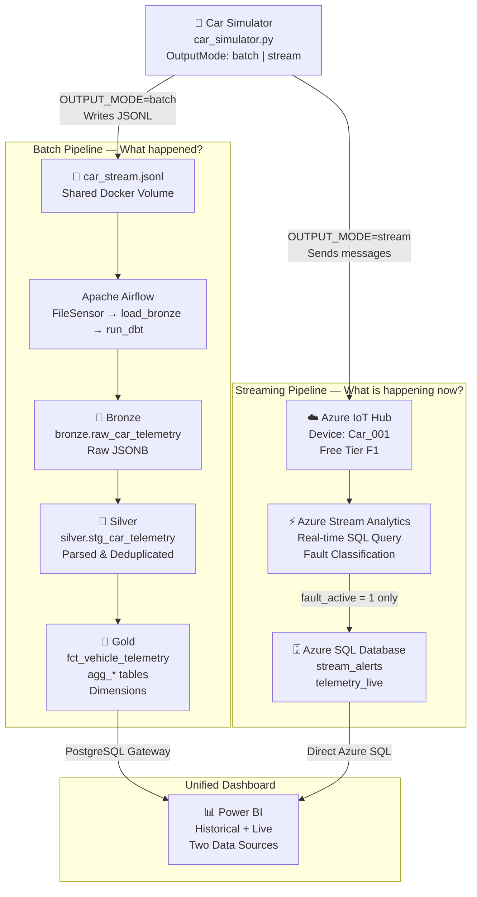
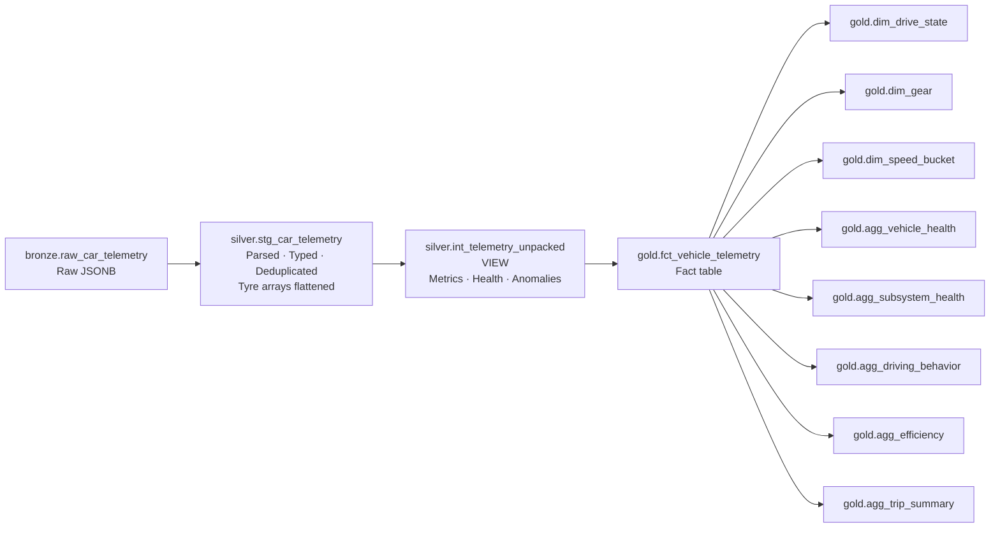
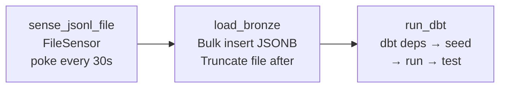
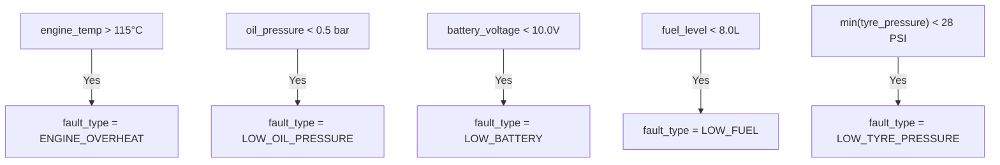
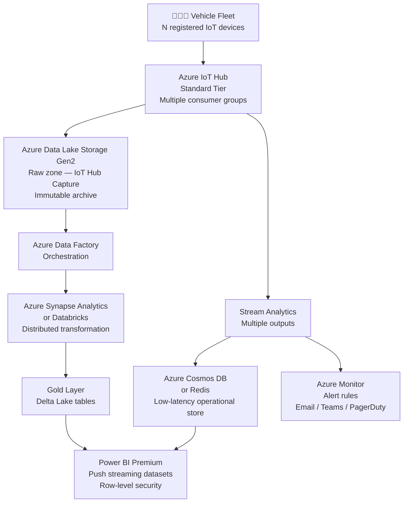

# 🚗 Car Telemetry Data Platform


---

## Executive Summary

The **Car Telemetry Data Platform** is a real-time IoT data engineering project that simulates vehicle sensor data and processes it through two purpose-built pipelines. A batch ETL pipeline built on Apache Airflow, dbt, and PostgreSQL answers historical analytical questions about vehicle behaviour and fleet health. A streaming pipeline built on Azure IoT Hub and Stream Analytics answers operational questions about what is happening right now. Both pipelines feed a single unified Power BI dashboard, demonstrating a production-grade architecture where real-time alerting and historical analytics coexist in one system.

---

## Table of Contents

1. [Architecture Overview](#1-architecture-overview)
2. [Getting Started](#2-getting-started)
3. [Simulator](#3-simulator)
4. [Batch Pipeline](#4-batch-pipeline)
5. [Streaming Pipeline](#5-streaming-pipeline)
6. [Dashboard](#6-dashboard)
7. [Architecture Decisions](#7-architecture-decisions)
8. [Cost Management](#8-cost-management)
9. [Project Milestones](#9-project-milestones)
10. [Known Limitations & Production Improvements](#10-known-limitations--production-improvements)

---

## 1. Architecture Overview

### High-Level Architecture



### dbt Lineage



### Airflow DAG



---

## 2. Getting Started

### Prerequisites

| Tool | Version | Purpose |
|---|---|---|
| Docker Desktop | Latest | Container runtime |
| Python | 3.11+ | Simulator local development |
| Azure Account | Free tier | IoT Hub, Stream Analytics, Azure SQL |
| Power BI Desktop | Latest | Dashboard authoring |
| Npgsql Driver | Latest | Power BI → PostgreSQL connection |

### Environment Setup

Copy the example environment file and fill in your values:

```bash
cp .env.example .env
```

Required `.env` variables:

| Variable | Description |
|---|---|
| `POSTGRES_USER` | PostgreSQL username |
| `POSTGRES_PASSWORD` | PostgreSQL password |
| `POSTGRES_DB` | Database name (`telemetry_dw`) |
| `POSTGRES_PORT` | Host port for PostgreSQL (default `5432`) |
| `AIRFLOW_UID` | Your host user ID (`id -u`) |
| `AIRFLOW_ADMIN_USER` | Airflow web UI username |
| `AIRFLOW_ADMIN_PASSWORD` | Airflow web UI password |
| `AIRFLOW__CORE__FERNET_KEY` | Airflow encryption key |
| `OUTPUT_MODE` | `batch` or `stream` |
| `IOTHUB_CONNECTION_STRING` | Azure IoT Hub device connection string (stream mode only) |
| `DBT_POSTGRES_HOST` | dbt PostgreSQL host (use `postgres` inside Docker) |
| `DBT_POSTGRES_USER` | dbt PostgreSQL username |
| `DBT_POSTGRES_PASSWORD` | dbt PostgreSQL password |
| `DBT_POSTGRES_DB` | dbt target database |
| `DBT_POSTGRES_SCHEMA` | dbt default schema |

### Running the Batch Pipeline

```bash
# Start all services
docker compose up -d

# Verify services are healthy
docker compose ps

# Access Airflow UI
open http://localhost:8080
```

The simulator starts automatically in `batch` mode (default). The Airflow DAG `car_telemetry_pipeline` runs every 5 minutes and will begin processing data automatically.

### Running the Streaming Pipeline

```bash
# Switch to stream mode in .env
OUTPUT_MODE=stream

# Restart only the simulator
docker compose up -d simulator --force-recreate
```

Ensure your Azure IoT Hub, Stream Analytics job, and Azure SQL database are provisioned before switching to stream mode. See [Streaming Pipeline](#5-streaming-pipeline) for Azure setup steps.

### Switching Between Modes

```bash
# Batch mode (default — local only, no Azure cost)
OUTPUT_MODE=batch docker compose up -d simulator --force-recreate

# Stream mode (requires Azure resources running)
OUTPUT_MODE=stream docker compose up -d simulator --force-recreate
```

---

## 3. Simulator

### Overview

The simulator (`simulator/car_simulator.py`) generates realistic vehicle telemetry using a deterministic physics model and a progressive fault injection system. It supports two output modes controlled entirely by the `OUTPUT_MODE` environment variable.

### Output Modes

| Mode | Destination | Use Case |
|---|---|---|
| `batch` | Writes `car_stream.jsonl` to shared Docker volume | Feeds Airflow batch pipeline |
| `stream` | Sends messages to Azure IoT Hub | Feeds Stream Analytics streaming pipeline |

### CLI Flags

| Flag | Default | Description |
|---|---|---|
| `--output-path` | `/data/car_stream.jsonl` | JSONL output path (batch mode) |
| `--ticks` | `None` (infinite) | Number of ticks to emit before stopping |
| `--real-time` | `True` | Sleep between ticks at configured interval |
| `--no-real-time` | — | Emit ticks as fast as possible (batch mode only) |
| `--tick-interval-seconds` | `0.5` | Seconds between ticks |
| `--seed` | `42` | RNG seed for repeatable output |

> **Note:** `--no-real-time` is silently ignored in stream mode. Stream mode always paces in real time to avoid exceeding the IoT Hub free tier daily message quota (8,000 messages/day).

### Drive Cycle

Each tick belongs to a 240-tick repeating drive cycle:

| Ticks | State | Behaviour |
|---|---|---|
| 0–29 | `IDLE` | Speed = 0, engine warming |
| 30–74 | `ACCELERATING` | Speed ramps to ~110 km/h |
| 75–169 | `CRUISING` | Speed holds 75–87 km/h |
| 170–209 | `BRAKING` | Speed decelerates to 0 |
| 210–239 | `STOPPED` | Speed = 0 |

### Fault Model

The simulator uses a **progressive degradation** fault model. Faults are not set randomly — they are the consequence of hidden subsystem failures degrading sensor readings over time, exactly as a real ECU operates.

#### Subsystem Failures

| Subsystem | Onset Probability/Tick | Sensor Effect | Recovery Probability/Tick |
|---|---|---|---|
| `cooling_system` | 0.2% | `engine_temp += min(d × 0.02, 20.0)` | 0.1% |
| `oil_leak` | 0.2% | `oil_pressure -= min(d × 0.005, 2.0)` | 0.1% |
| `battery_degradation` | 0.15% | `battery_voltage -= 0.015` per tick | 0.1% |
| `fuel_leak` | 0.15% | `fuel_level -= 0.03` per tick, `fuel_flow × 1.15` | 0.1% |
| `tyre_puncture` | 0.3% | One tyre: `pressure -= 0.03` per tick | 0.1% |

`d` = number of ticks the failure has been active. Battery voltage, tyre pressure, and tyre temp are persisted in `SimulatorState` between ticks so degradation is continuous across the simulation lifetime.

#### Fault Detection (ECU-Style)

After sensor values are updated, faults are detected by threshold breach:



### Telemetry Schema

Every tick emits a JSON record with the following fields:

| Field | Type | Description |
|---|---|---|
| `timestamp` | ISO 8601 string | UTC timestamp of the tick |
| `tick` | int | Monotonically incrementing tick counter |
| `rpm` | float | Engine revolutions per minute |
| `speed_kmh` | float | Vehicle speed in km/h |
| `engine_temp` | float | Engine coolant temperature (°C) |
| `oil_temp` | float | Engine oil temperature (°C) |
| `oil_pressure` | float | Oil pressure (bar) |
| `throttle` | float | Throttle position 0–100% |
| `fuel_level` | float | Fuel remaining (litres) |
| `fuel_flow` | float | Fuel consumption rate (L/h) |
| `battery_voltage` | float | Battery voltage (V) |
| `brake_pressure` | float | Brake line pressure (bar) |
| `odometer_km` | float | Cumulative distance (km) |
| `trip_km` | float | Current trip distance (km) |
| `gear` | int | Current gear (0 = neutral/park) |
| `ignition_on` | bool | Ignition state |
| `alternator_on` | bool | Alternator charging state |
| `abs_active` | bool | ABS intervention active |
| `check_engine` | bool | Check engine warning light |
| `low_fuel_warn` | bool | Low fuel warning light |
| `drive_state` | string | `IDLE \| ACCELERATING \| CRUISING \| BRAKING \| STOPPED` |
| `tyre_pressure` | float[4] | Tyre pressures FL, FR, RL, RR (PSI) |
| `tyre_temp` | float[4] | Tyre temperatures FL, FR, RL, RR (°C) |
| `fault_active` | bool | True when any fault threshold is breached |
| `fault_type` | string | Active fault code or `NONE` |

---

## 4. Batch Pipeline

### Overview

The batch pipeline ingests raw telemetry from the simulator's JSONL output, loads it into PostgreSQL, and transforms it through a three-layer medallion architecture using dbt.

### Airflow DAG: `car_telemetry_pipeline`

**Schedule:** Every 5 minutes (`*/5 * * * *`)

| Task | Type | Description |
|---|---|---|
| `sense_jsonl_file` | `FileSensor` | Waits for data in `/opt/airflow/data/car_stream.jsonl`. Pokes every 30 seconds, times out after 5 minutes. Uses `reschedule` mode to free the worker slot while waiting. |
| `load_bronze` | `@task` (Python) | Reads all lines from the JSONL file, parses each as JSON, bulk inserts into `bronze.raw_car_telemetry` using `execute_values`. Truncates the file after successful insert to prevent re-ingestion. |
| `run_dbt` | `BashOperator` | Runs `dbt deps → dbt seed → dbt run → dbt test` sequentially with `set -euo pipefail` to fail fast on any error. |

### Bronze Layer

Raw telemetry is stored exactly as received with no transformation. This provides an immutable audit trail and allows reprocessing if downstream logic changes.

**Table:** `bronze.raw_car_telemetry`

| Column | Type | Description |
|---|---|---|
| `id` | SERIAL | Auto-incrementing primary key |
| `ingested_at` | TIMESTAMPTZ | Airflow ingestion timestamp |
| `raw_data` | JSONB | Complete raw telemetry record |

### Silver Layer

**Model:** `silver.stg_car_telemetry` (materialized as view)

Responsibilities:
- Parses all JSONB fields to typed PostgreSQL columns using `->>`  and `::` casting
- Flattens `tyre_pressure` and `tyre_temp` arrays into individual columns (`tyre_pressure_FL/FR/RL/RR`, `tyre_temp_FL/FR/RL/RR`)
- Deduplicates records on `(timestamp, tick)` keeping the most recently ingested row — protects against re-ingestion from file truncation failures

**Model:** `silver.int_telemetry_unpacked` (materialized as view)

Responsibilities:
- Unit conversions: Celsius → Fahrenheit for all temperature fields
- Fuel consumption calculation per tick using `fuel_flow` and tick interval
- Speed bucketing: `city` (<30 km/h) / `suburban` (30–90 km/h) / `highway` (>90 km/h)
- Derived metrics: `avg_tyre_pressure`, `avg_tyre_temp`, `tyre_pressure_imbalance`, `tyre_temp_imbalance`, `thermal_delta`, `thermal_stress`, `engine_load`, `gear_group`
- Health classification per subsystem (`engine_status`, `oil_status`, `battery_status`, `fuel_status`, `tyre_status`)
- Overall `vehicle_health` score and `ready_for_trip` flag

#### Health Classification Thresholds

| Subsystem | WARNING | CRITICAL |
|---|---|---|
| Engine | temp ≥ 105°C or HIGH_LOAD | temp ≥ 125°C or RPM ≥ 6800 or HIGH thermal stress + temp ≥ 115°C |
| Oil | pressure ≤ 1.3 bar or temp ≥ 115°C | pressure ≤ 1.1 bar or temp ≥ 130°C |
| Battery | voltage ≤ 11.8V | voltage ≤ 10.5V |
| Fuel | level ≤ 15L | level ≤ 5L |
| Tyres | avg pressure < 28 PSI or avg temp > 80°C or imbalance > 4/10 | avg pressure < 26 PSI or avg temp > 90°C or imbalance > 7/15 |

### Gold Layer

**Fact table:** `gold.fct_vehicle_telemetry`

Selects all columns from `int_telemetry_unpacked` as the primary analytical fact table. This is the source for all downstream aggregates.

**Dimension tables:**

| Table | Description |
|---|---|
| `gold.dim_drive_state` | Drive state reference with labels and descriptions |
| `gold.dim_gear` | Gear reference with gear group classifications |
| `gold.dim_speed_bucket` | Speed bucket reference (city / suburban / highway) |

**Aggregate tables:**

| Table | Grain | Key Metrics |
|---|---|---|
| `gold.agg_trip_summary` | Entire session | Distance, fuel consumed, km/litre, avg/max speed, health event counts |
| `gold.agg_vehicle_health` | Per `vehicle_health` level | Event counts, percentages, anomaly rates, avg sensor readings per health state |
| `gold.agg_subsystem_health` | Per subsystem | Normal/warning/critical event counts, failure rates, severity score |
| `gold.agg_driving_behavior` | Per `speed_bucket × drive_state × engine_load` | Avg speed, rpm, fuel consumption, failure rates per driving context |
| `gold.agg_efficiency` | Per `speed_bucket` | Fuel efficiency (km/L, L/km), high engine load percentage, distance and fuel totals |

---

## 5. Streaming Pipeline

### Overview

The streaming pipeline processes telemetry in real time, classifying fault events and writing them to Azure SQL for live dashboard consumption. Only fault events are written — not every telemetry tick — keeping the operational store lean and focused on actionable alerts.

### Azure Setup

#### Step 1 — IoT Hub

1. Create an IoT Hub → Free tier **F1**
2. Add a device → name it `Car_001`
3. Copy the device's **Primary Connection String** → add to `.env` as `IOTHUB_CONNECTION_STRING`

> **Free tier limit:** 8,000 messages/day. At 0.5s tick interval this supports approximately 1.1 hours of continuous streaming. At 2s intervals this supports approximately 4.4 hours.

#### Step 2 — Azure SQL Database

Create the two tables in Azure SQL Query Editor:

**`telemetry_live`** — full raw telemetry stream (every tick):

```sql
CREATE TABLE telemetry_live (
    timestamp       DATETIME2,
    tick            INT,
    speed_kmh       FLOAT,
    rpm             FLOAT,
    throttle        FLOAT,
    engine_temp     FLOAT,
    oil_temp        FLOAT,
    oil_pressure    FLOAT,
    battery_voltage FLOAT,
    fuel_level      FLOAT,
    fuel_flow       FLOAT,
    odometer_km     FLOAT,
    trip_km         FLOAT,
    gear            INT,
    drive_state     NVARCHAR(50),
    ignition_on     BIT,
    alternator_on   BIT,
    abs_active      BIT,
    check_engine    BIT,
    low_fuel_warn   BIT,
    brake_pressure  FLOAT,
    tyre_pressure_fl FLOAT,
    tyre_pressure_fr FLOAT,
    tyre_pressure_rl FLOAT,
    tyre_pressure_rr FLOAT,
    tyre_temp_fl    FLOAT,
    tyre_temp_fr    FLOAT,
    tyre_temp_rl    FLOAT,
    tyre_temp_rr    FLOAT,
    fault_active    BIT,
    fault_type      NVARCHAR(100)
);
```

**`stream_alerts`** — fault events only, with classification:

```sql
CREATE TABLE stream_alerts (
    id              INT IDENTITY(1,1) PRIMARY KEY,
    tick            INT,
    fault_type      NVARCHAR(50),
    subsystem       NVARCHAR(20),
    severity        NVARCHAR(20),
    message         NVARCHAR(255),
    drive_state     NVARCHAR(20),
    engine_status   NVARCHAR(20),
    oil_status      NVARCHAR(20),
    battery_status  NVARCHAR(20),
    fuel_status     NVARCHAR(20),
    tyre_status     NVARCHAR(20),
    engine_temp     FLOAT,
    oil_pressure    FLOAT,
    battery_voltage FLOAT,
    fuel_level      FLOAT,
    speed_kmh       FLOAT,
    min_tyre_pressure FLOAT,
    max_tyre_temp   FLOAT,
    created_at      DATETIME2 DEFAULT SYSUTCDATETIME()
);
```

#### Step 3 — Azure SQL Firewall

Azure Portal → SQL Server → Networking → Exceptions:
- Enable **"Allow Azure services and resources to access this server"** ✅

#### Step 4 — Stream Analytics Job

**Input:** IoT Hub → alias `IoThub` → consumer group `$Default`

**Output 1:** Azure SQL → alias `telemetry_output` → table `telemetry_live`

**Output 2:** Azure SQL → alias `alertslive_output` → table `stream_alerts`

### Stream Analytics Queries

**Query 1 — Full telemetry passthrough to `telemetry_live`:**

```sql
SELECT
    timestamp, tick, speed_kmh, rpm, throttle,
    engine_temp, oil_temp, oil_pressure,
    battery_voltage, fuel_level, fuel_flow,
    odometer_km, trip_km, gear, drive_state,
    ignition_on, alternator_on, abs_active, check_engine, low_fuel_warn,
    brake_pressure,
    GetArrayElement(tyre_pressure, 0) AS tyre_pressure_fl,
    GetArrayElement(tyre_pressure, 1) AS tyre_pressure_fr,
    GetArrayElement(tyre_pressure, 2) AS tyre_pressure_rl,
    GetArrayElement(tyre_pressure, 3) AS tyre_pressure_rr,
    GetArrayElement(tyre_temp, 0) AS tyre_temp_fl,
    GetArrayElement(tyre_temp, 1) AS tyre_temp_fr,
    GetArrayElement(tyre_temp, 2) AS tyre_temp_rl,
    GetArrayElement(tyre_temp, 3) AS tyre_temp_rr,
    fault_active, fault_type
INTO telemetry_output
FROM [IoThub-input];
```

**Query 2 — Fault classification to `stream_alerts`:**

```sql
SELECT
    System.Timestamp()                              AS event_time,
    input.tick,
    input.fault_type,
    CASE
        WHEN input.fault_type LIKE '%ENGINE%'  THEN 'ENGINE'
        WHEN input.fault_type LIKE '%OIL%'     THEN 'OIL'
        WHEN input.fault_type LIKE '%BATTERY%' THEN 'BATTERY'
        WHEN input.fault_type LIKE '%FUEL%'    THEN 'FUEL'
        WHEN input.fault_type LIKE '%TYRE%'    THEN 'TYRES'
        ELSE 'GENERAL'
    END AS subsystem,
    CASE
        WHEN input.fault_type = 'ENGINE_OVERHEAT'   THEN 'Engine temperature exceeded safe operating range'
        WHEN input.fault_type = 'LOW_OIL_PRESSURE'  THEN 'Oil pressure below safe operating range'
        WHEN input.fault_type = 'LOW_BATTERY'       THEN 'Battery voltage below operating threshold'
        WHEN input.fault_type = 'LOW_FUEL'          THEN 'Fuel level critically low'
        WHEN input.fault_type = 'LOW_TYRE_PRESSURE' THEN 'Tyre pressure below recommended level'
        ELSE 'Vehicle fault detected'
    END AS message,
    input.drive_state,
    input.engine_temp,
    input.oil_pressure,
    input.battery_voltage,
    input.fuel_level,
    input.speed_kmh,
    -- Min tyre pressure (manual CASE — GetArrayElement returns individual elements)
    CASE
        WHEN GetArrayElement(input.tyre_pressure,0) <= GetArrayElement(input.tyre_pressure,1)
         AND GetArrayElement(input.tyre_pressure,0) <= GetArrayElement(input.tyre_pressure,2)
         AND GetArrayElement(input.tyre_pressure,0) <= GetArrayElement(input.tyre_pressure,3)
            THEN GetArrayElement(input.tyre_pressure,0)
        WHEN GetArrayElement(input.tyre_pressure,1) <= GetArrayElement(input.tyre_pressure,2)
         AND GetArrayElement(input.tyre_pressure,1) <= GetArrayElement(input.tyre_pressure,3)
            THEN GetArrayElement(input.tyre_pressure,1)
        WHEN GetArrayElement(input.tyre_pressure,2) <= GetArrayElement(input.tyre_pressure,3)
            THEN GetArrayElement(input.tyre_pressure,2)
        ELSE GetArrayElement(input.tyre_pressure,3)
    END AS min_tyre_pressure,
    -- Max tyre temp
    CASE
        WHEN GetArrayElement(input.tyre_temp,0) >= GetArrayElement(input.tyre_temp,1)
         AND GetArrayElement(input.tyre_temp,0) >= GetArrayElement(input.tyre_temp,2)
         AND GetArrayElement(input.tyre_temp,0) >= GetArrayElement(input.tyre_temp,3)
            THEN GetArrayElement(input.tyre_temp,0)
        WHEN GetArrayElement(input.tyre_temp,1) >= GetArrayElement(input.tyre_temp,2)
         AND GetArrayElement(input.tyre_temp,1) >= GetArrayElement(input.tyre_temp,3)
            THEN GetArrayElement(input.tyre_temp,1)
        WHEN GetArrayElement(input.tyre_temp,2) >= GetArrayElement(input.tyre_temp,3)
            THEN GetArrayElement(input.tyre_temp,2)
        ELSE GetArrayElement(input.tyre_temp,3)
    END AS max_tyre_temp,
    -- Per-subsystem status
    CASE WHEN input.engine_temp >= 120    THEN 'CRITICAL' WHEN input.engine_temp >= 105    THEN 'WARNING' ELSE 'NORMAL' END AS engine_status,
    CASE WHEN input.oil_pressure < 0.8   THEN 'CRITICAL' WHEN input.oil_pressure < 1.2   THEN 'WARNING' ELSE 'NORMAL' END AS oil_status,
    CASE WHEN input.battery_voltage < 10.5 THEN 'CRITICAL' WHEN input.battery_voltage < 11.5 THEN 'WARNING' ELSE 'NORMAL' END AS battery_status,
    CASE WHEN input.fuel_level < 5       THEN 'CRITICAL' WHEN input.fuel_level < 15      THEN 'WARNING' ELSE 'NORMAL' END AS fuel_status,
    -- Overall severity
    CASE
        WHEN input.engine_temp >= 120 OR input.oil_pressure < 0.8
          OR input.battery_voltage < 10.5 OR input.fuel_level < 5
            THEN 'CRITICAL'
        WHEN input.engine_temp >= 105 OR input.oil_pressure < 1.2
          OR input.battery_voltage < 11.5 OR input.fuel_level < 15
            THEN 'WARNING'
        ELSE 'INFO'
    END AS severity
INTO alertslive_output
FROM [IoThub] AS input
WHERE input.fault_active = 1;
```

> **Important:** Stream Analytics interprets JSON boolean `true` as integer `1` internally. Use `WHERE input.fault_active = 1`, not `= True` or `= 'true'`.

---

## 6. Dashboard

### Data Sources

| Source | Connection Method | Tables Used |
|---|---|---|
| PostgreSQL (local Docker) | Power BI On-Premises Data Gateway | All `gold.*` tables |
| Azure SQL Database | Direct Azure SQL connector | `stream_alerts`, `telemetry_live` |

### Dashboard Pages

#### Page 1 — Vehicle Health Overview

| Visual | Source | Description |
|---|---|---|
| Live alert feed table | Azure SQL `stream_alerts` | Most recent fault events with severity, subsystem, message |
| Subsystem health donut charts | PostgreSQL `agg_subsystem_health` | Historical NORMAL/WARNING/CRITICAL split per subsystem |
| Severity trend line | PostgreSQL `fct_vehicle_telemetry` | Vehicle health state over time |

#### Page 2 — Engine & Powertrain

| Visual | Source | Description |
|---|---|---|
| Live engine temp gauge | Azure SQL `telemetry_live` | Current engine temperature reading |
| Engine temp trend line | PostgreSQL `fct_vehicle_telemetry` | Historical temperature over time |
| Oil pressure gauge | Azure SQL `telemetry_live` | Current oil pressure |
| Overheat event history | PostgreSQL `agg_subsystem_health` | Historical ENGINE failure rate |

#### Page 3 — Driving Behavior & Efficiency

| Visual | Source | Description |
|---|---|---|
| Speed distribution bar chart | PostgreSQL `agg_driving_behavior` | Event count by speed bucket |
| Fuel efficiency by speed bucket | PostgreSQL `agg_efficiency` | km/L and L/km per speed category |
| Live fuel level gauge | Azure SQL `telemetry_live` | Current fuel level |
| Fuel consumption trend | PostgreSQL `fct_vehicle_telemetry` | Cumulative fuel consumed over time |

#### Page 4 — Trip Summary

| Visual | Source | Description |
|---|---|---|
| KPI cards | PostgreSQL `agg_trip_summary` | Total distance, avg speed, total fuel, km/litre, ready_trip_rate |
| Live fault counter | Azure SQL `stream_alerts` | COUNT of alerts in current session |

### Live Refresh

Set Power BI page refresh on pages showing Azure SQL data:
Format pane → Page refresh → On → interval: 30 seconds.

---

## 7. Architecture Decisions

### Decision 1 — Batch and stream run as separate sessions, not simultaneously

**Context:** Early in development, a `both` output mode was considered to have the simulator write to the JSONL file and send to IoT Hub simultaneously in one loop.

**Decision:** Removed. Batch and stream run as separate sessions controlled by `OUTPUT_MODE`.

**Rationale:** The two pipelines have mutually exclusive pacing requirements. The batch pipeline requires the simulator to pause after writing a batch and wait for Airflow to drain the file before writing more — otherwise the file grows unboundedly. The streaming pipeline requires the simulator to never pause — a freeze in sends causes gaps in the live dashboard. Forcing both into one loop means either the file grows forever or the stream freezes while waiting for Airflow. Neither is acceptable. The production solution for true simultaneous operation would be rotating JSONL files (write `car_stream_0001.jsonl`, rotate every N records, let Airflow watch a directory), but this adds infrastructure complexity that is not required to demonstrate the architecture.

### Decision 2 — Fault detection lives in the analytics layer, not the simulator

**Context:** An earlier simulator version set `fault_active=True` directly when injecting a random fault, effectively making the simulator aware of business classifications.

**Decision:** The simulator emits raw sensor readings only. Fault detection (`fault_type`, `severity`, subsystem status) is derived entirely in Stream Analytics SQL and dbt models.

**Rationale:** The simulator's responsibility is physical simulation — it should model how a cooling system failure degrades engine temperature over time. Whether a given temperature constitutes a `WARNING` or `CRITICAL` fault is a business rule. Keeping these separate means threshold changes require only SQL/dbt edits, not simulator code changes. It also means both pipelines can apply their own threshold logic independently — dbt uses more sophisticated multi-condition rules, Stream Analytics uses simpler real-time rules — without either constraining the other.

### Decision 3 — OUTPUT_MODE is an environment variable

**Context:** Switching the simulator between batch and stream modes could have been implemented as a CLI flag or a code-level constant.

**Decision:** `OUTPUT_MODE` is read from the environment via `os.getenv("OUTPUT_MODE", "batch")` in `azure_config.py`.

**Rationale:** Environment variables are the production-standard mechanism for configuration that differs between deployment contexts. Using an env var means switching modes requires only a `.env` change and container restart, with no code modifications. This matches twelve-factor app principles and is how real IoT device firmware configuration works.

### Decision 4 — PostgreSQL is the single source of historical truth

**Context:** Azure SQL could have accumulated all streaming data over time in addition to serving live alerts.

**Decision:** Azure SQL is operational and ephemeral — it holds only the current session's alerts. PostgreSQL holds all historical data.

**Rationale:** Having two systems accumulate historical data creates a reconciliation problem: if they ever diverge, which one is authoritative? PostgreSQL already stores the full historical record via the batch pipeline's Bronze → Gold layers. Making Azure SQL authoritative for anything historical would duplicate that responsibility and introduce cost (Azure SQL billing is continuous for stored data). Azure SQL is the right tool for serving low-latency live queries; PostgreSQL is the right tool for analytical history.

### Decision 5 — `--no-real-time` applies to batch mode only

**Context:** The `--no-real-time` flag was originally applied globally, affecting both batch and stream output.

**Decision:** In stream mode, `real_time` is forced to `True` regardless of the CLI flag, with a printed warning if overridden.

**Rationale:** The Azure IoT Hub free tier allows 8,000 messages per day. Sending without sleep pacing would exhaust this quota in minutes with no benefit — Stream Analytics and the dashboard are not designed to consume burst-rate data and would not render it any differently. The `--no-real-time` flag exists specifically for bulk-generating historical JSONL data for dbt testing, a use case that only applies to batch mode.

---

## 8. Cost Management

### Azure Resources and Idle Billing

| Resource | Bills While Idle? | Recommendation |
|---|---|---|
| IoT Hub F1 (Free tier) | No — genuinely free | Leave provisioned permanently |
| Stream Analytics | Yes — per streaming unit hour while Running | Stop and delete after each session |
| Azure SQL Database | Yes — continuous compute billing | Delete after each session (recreate takes ~3 min) |
| Azure SQL Server | No — server itself does not bill | Can leave provisioned |

### Session Workflow

#### Starting a stream session

```
1. Create Azure SQL Database (Basic tier)
2. Create stream_alerts and telemetry_live tables
3. Create Stream Analytics job
4. Configure IoT Hub input and SQL outputs
5. Start Stream Analytics job
6. Set OUTPUT_MODE=stream, restart simulator
```

#### Ending a stream session

```
1. Stop simulator (docker compose stop simulator)
2. Stop and DELETE Stream Analytics job
3. DELETE Azure SQL Database (keep server)
4. IoT Hub — leave running (free)
```

> **Billing lag:** Azure billing reports with a 24–48 hour delay. Charges appearing today for a resource you deleted yesterday are normal tail billing — they will not continue.

### Estimated Session Cost

A 2-hour stream demo session costs approximately $0.20–0.40 depending on Stream Analytics streaming units and Azure SQL tier selected.

---

## 9. Project Milestones

| Milestone | Requirement | Implementation |
|---|---|---|
| **Milestone 1 — Data Simulation** | Python script generating sensor data every 5 seconds | `car_simulator.py` — progressive fault model, five subsystems, 27-field telemetry schema, `--real-time` / `--no-real-time` pacing modes |
| **Milestone 2 — Batch ETL** | Ingest, transform, load into SQL or Data Lake | Airflow DAG with FileSensor + Bronze load, dbt Bronze → Silver → Gold medallion architecture, PostgreSQL data warehouse |
| **Milestone 3 — Streaming Pipeline** | Azure Stream Analytics, real-time alerts, threshold alerting | Azure IoT Hub ingestion, Stream Analytics fault classification query, `stream_alerts` table in Azure SQL |
| **Milestone 4 — Dashboard & Report** | Real-time dashboard, key findings | Power BI with dual data sources (PostgreSQL Gateway + Azure SQL direct), four analytical pages combining live and historical data |

---

## 10. Known Limitations & Production Improvements

### Current Limitations

| Limitation | Impact | Production Solution |
|---|---|---|
| Single simulated car (`Car_001`) | No fleet-level analytics | Multiple device registrations, `device_id` field in all records, fleet aggregation in dbt |
| JSONL file as batch ingestion mechanism | Requires backpressure wait, can't run simultaneously with stream | Rotating JSONL files (write to `car_stream_0001.jsonl`, roll every N records, Airflow watches directory) |
| Simulator state resets on container restart | Duplicate tick values if container restarts unexpectedly | Persist tick counter to shared volume state file, reload on startup |
| Azure SQL is ephemeral (deleted each session) | No long-term alert history | Archive `stream_alerts` to PostgreSQL via Airflow sweep job before teardown |
| `--no-real-time` unavailable in stream mode | Cannot fast-generate streaming test data | Separate test harness for Stream Analytics with pre-recorded message replay |
| Power BI live tiles poll every 30 seconds | Not truly real-time | Stream Analytics → Power BI Streaming Dataset (push API) for sub-second dashboard updates |
| dbt runs inside Airflow container | Tight coupling, harder to version independently | Dedicated dbt Cloud or separate dbt container with shared network |
| Single Airflow worker (no CeleryExecutor) | Limited parallelism | CeleryExecutor with Redis broker for production-scale orchestration |

### What This Would Look Like in Production


